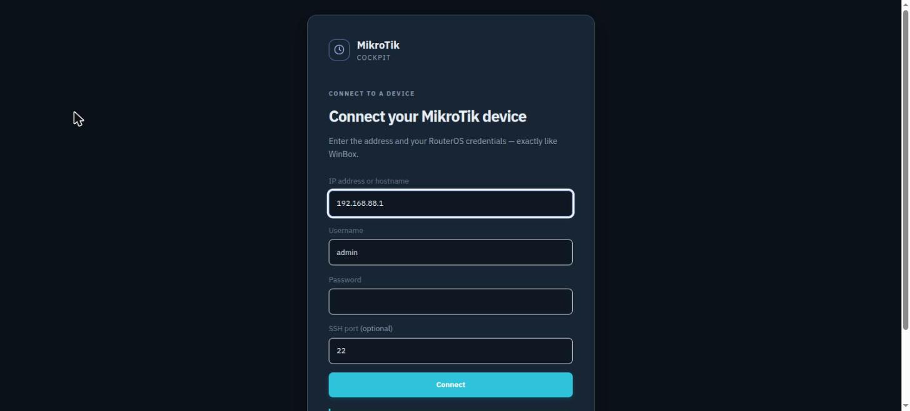
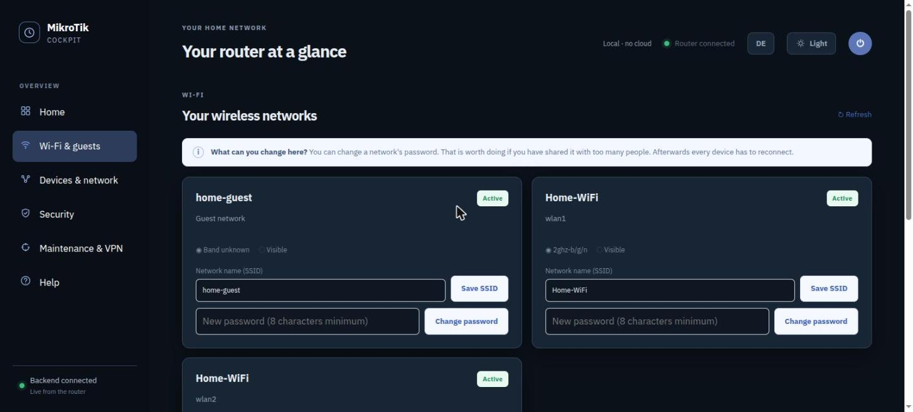
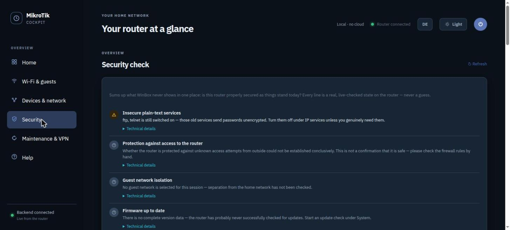
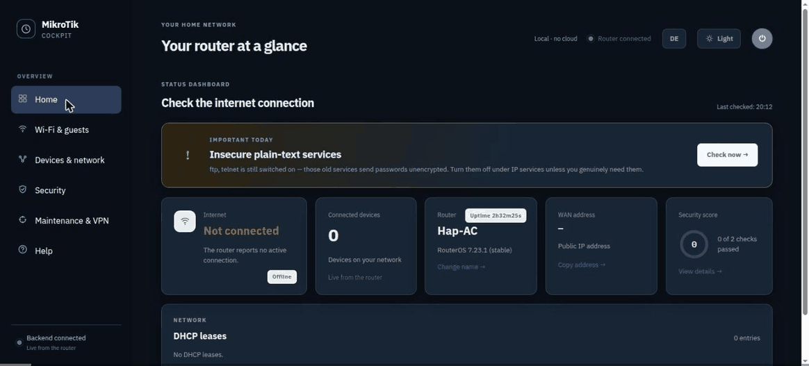

# MikroTik Cockpit

> A live, browser-based management UI for MikroTik RouterOS — with plain-language explanations, safety warnings, and device direct-links. Think WinBox, but for the 80 % of daily tasks.

[](LICENSE)
[](#)
[](#)

**Status:** Working prototype — 218 backend tests, security audited, live-verified against RouterOS 7.23.1 on real hardware (MikroTik hAP ac Lite). Not yet a polished commercial product.

**Language:** The interface speaks English and German. It follows your browser language and can be switched any time with the EN/DE button in the header.

---

## Screenshots

*(see SHOW.md for what makes this different)*

| Connect screen | Dashboard | Wi-Fi settings | Security check |
|---|---|---|---|
|  |  |  |  |

*Taken live against a MikroTik hAP ac Lite on an isolated test VLAN — which is why it reports no
internet and no connected devices. Nothing here is mocked up; only the network names were replaced
with neutral ones before publishing.*



60-second walkthrough on YouTube (German voice-over, English UI available in the app): https://www.youtube.com/watch?v=eTpmH4RkWiM

---

## Features

### Free tier (open source, AGPL v3)

| Feature | Description |
|---|---|
| **Dashboard** | Internet status, uptime, WAN address, connected devices, security score |
| **DHCP Leases** | Live list of all DHCP clients with manufacturer lookups |
| **Devices** | Assign rooms, reserve IP addresses, disconnect a Wi-Fi client, open a device's own web UI |
| **Wi-Fi** | View networks, change SSID and password — with a 5-minute undo window |
| **Router identity** | Change router name |
| **Port forwarding** | Add, list, and remove port forwards with conflict detection |
| **Backup** | Export RouterOS backup, download it, restore it |
| **Network** | Change IP address, DNS servers, DHCP client mode, WAN interface |
| **DHCP Ranges** | Add and remove DHCP server ranges per interface |
| **Security check** | Plain-language audit of services, router access, guest isolation, firmware and backup age |

### Pro tier (Cockpit Pro, via GitHub Sponsors)

Not part of this repository. These features live in a private repository that sponsors get
access to: **[Sponsor on GitHub](https://github.com/sponsors/BreuerM1975)**, $5/month (access
for as long as you sponsor, updates included) or $49 one-time (you keep what you download).
GitHub sends the repository invitation automatically for monthly sponsors; one-time sponsors
are added by hand, usually within a day. Install is one script (`install-pro.sh`) that copies
four files into this checkout and can remove them again.

| Feature | Description |
|---|---|
| **Firewall** | View, add, enable/disable, delete Forward, Input, and NAT rules |
| **IP Services** | Toggle ftp/ssh/www/api/winbox on and off |
| **Users** | Create your own login, set read-only accounts for the family, disable `admin` — with lock-out protection built in |
| **Router password** | Change the login password — with a 5-minute undo window |
| **Reboot** | Restart the router |
| **VPN (WireGuard)** | Add peers, download .conf files |
| **PPPoE** | Set up WAN connection for DSL |
| **Guest network** | Control guest SSID and isolation |
| **Firmware** | Check for and install RouterOS updates |

---

## Quick start

### Prerequisites

- A **Linux desktop** (Windows version: planned after Linux validation)
- **Python 3.10+** with `pip`
- **sshpass** — install via your package manager:
  ```bash
  # Debian/Ubuntu
  sudo apt install sshpass python3-pip

  # Fedora
  sudo dnf install sshpass python3-pip

  # Arch
  sudo pacman -S sshpass python3-pip
  ```
- A MikroTik router with **SSH enabled** (IP → Services → ssh)
- A user account with **write access** (Group `full`)

### Install

```bash
# Clone the repo
git clone https://github.com/BreuerM1975/mikrotik-cockpit.git
cd mikrotik-cockpit

# Install dependencies into the project-local virtual environment
./install-cockpit.sh

# Start Cockpit with dependency and port checks
./start-cockpit.sh
```

The installer creates a project-local `.venv/`, installs the Python dependencies from
`app/backend/requirements.txt`, checks the Linux tools needed at startup and adds a
**"MikroTik Cockpit" entry to your application menu** (a `.desktop` file in
`~/.local/share/applications/`, for your user only). It never runs `sudo` and never changes your
router configuration. Use `./install-cockpit.sh --check` to only verify the prerequisites,
`./install-cockpit.sh --start` to install and start in one go, or `./install-cockpit.sh --remove-menu`
to take the menu entry away again. Missing system tools are reported with the matching
package-manager command for Debian/Ubuntu, Fedora and Arch.

From then on, start Cockpit from the application menu like any other program: it launches the
service and opens **http://127.0.0.1:8787/** in your browser. A second click while it is running
just opens the browser again, unless you updated Cockpit in between (`git pull`): then the click
restarts the service so the update takes effect, an open tab reloads itself, and you connect once more. If a start fails without a terminal, the error shows up as a desktop
notification.

Enter your router's IP address, username, and password — just like WinBox.

### First-time test

Don't have a router handy? You can't easily test Cockpit without one — it connects *live* to your RouterOS device. If you have a MikroTik in your lab or homelab, that's all you need.

---

## Architecture

```
Your browser (localhost)
    │  fetch to http://127.0.0.1:8787
    ▼
Cockpit Backend (Flask, runs locally)
    │  SSH to your router
    ▼
Your MikroTik Router (RouterOS)
```

- **Backend:** Python/Flask, binds only to `127.0.0.1` (not accessible from LAN)
- **Communication:** SSH to RouterOS — no REST API dependency (port 80/443 is often firewalled on MikroTik devices)
- **No database, no cloud, no accounts** — session lives in memory only
- **No fixed router configuration** — enter credentials each session, just like WinBox

---

## Comparison: Cockpit vs. WinBox

| | WinBox | Cockpit |
|---|---|---|
| **Platform** | Windows only (Wine on Linux) | Cross-platform (Python) |
| **Learning curve** | Steep — shows every RouterOS knob | Gentle — explains each setting |
| **Safety warnings** | None | SSH warning, IP-change warning, reboot confirmation, managed-rule protection |
| **Device links** | None | OUI-based direct links to web UIs (Shelly, ESPHome, etc.) |
| **Cloud/account** | None | None — fully local |
| **Deep RouterOS features** | All of them | Daily 80 % — VLANs, BGP etc. still need WinBox |
| **Installation** | Download .exe | `./install-cockpit.sh`, then a menu entry |

---

## Security

- **Local only** — backend binds to `127.0.0.1` (not accessible from the LAN)
- **No stored credentials** — passwords live in memory, gone when you close the session
- **No cloud dependency** — no account, no telemetry, no central server
- **Audit completed** — 18 findings, P0 and P1 closed. See `SHOW.md` for details
- **SSH is your only connection** — do NOT disable SSH on your router (IP → Services) unless you have WinBox access as a fallback

---

## How is this different from...?

| Tool | Difference |
|---|---|
| **WebFig** | RouterOS built-in, but just as complex as WinBox — no explanations, no device links |
| **MikroWizard** | Separate project, different focus (wizard-based setup) |
| **MikroMCP / MikroTik MCP** | AI/LLM integration APIs, not a user-facing management UI |
| **[MikroTik Config Generator](https://mikrotik.smarthomeblox.com)** (same author) | Offline config builder — generates .rsc files from a form, no live connection. Cockpit is what you use *after* the router runs |

---

## License

**AGPL v3** for the free tier (open-source features listed above).

For commercial use, integration into proprietary products (e.g., RouterOS itself), or extended features — contact us for a commercial license. This follows the same model as MySQL, GitLab, Redis, and Nginx: the community gets a powerful free tool, enterprises pay for rights the AGPL doesn't grant.

See [`LICENSE`](LICENSE) for the full license text.

---

## Development

Run the tests:

```bash
# Backend tests
python3 -m unittest discover -s app/backend/src -q

# Language check: verifies every backend message has an English translation
python3 app/frontend/test-language-static.py
```

Current test count: **218 backend tests**, all green. They mock the router, so no hardware is
needed.

The interface is written in German and translated at the DOM level: `i18n.js` looks each string up
in `dict-en.js`, falls back to the patterns in `patterns-en.js` for sentences that carry values,
and finally to `substitutions-en.js` for strings assembled from parts. After changing any
user-facing text, run the language check above.

**A note on the code itself:** comments and the backend's own error messages are in German. The
messages reach users only through the interface, where they are translated; anyone calling the API
directly will see German text. Pull requests in either language are welcome.

---

## From the same author

- **Mastering MikroTik RouterOS** (English, paperback/hardcover/Kindle): https://www.amazon.com/dp/B0HJYVSF2X — the book explains what every line of a RouterOS config does; Cockpit is the tool for the day after you have read it.
- **Das deutsche MikroTik Kompendium** (German edition of the same book): https://www.amazon.de/dp/B0H4BR6KJR
- **MikroTik Config Generator + Config Doctor**: https://mikrotik.smarthomeblox.com — builds a secure base configuration from a form, and checks your own `/export` for common mistakes.
- **RouterOS Blaupause** (YouTube, German): https://www.youtube.com/@routerosblaupause — walkthroughs of the topics above, including the Cockpit videos.

---

## Disclaimer

MikroTik is a registered trademark of MikroTikls SIA. This project is not affiliated with, endorsed by, or sponsored by MikroTik. Use at your own risk — configuration changes are applied immediately, no Safe Mode available.
